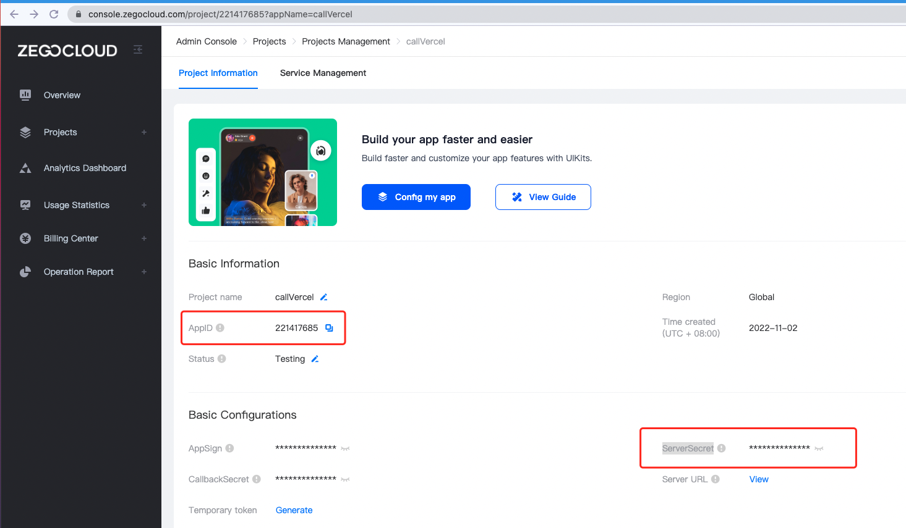
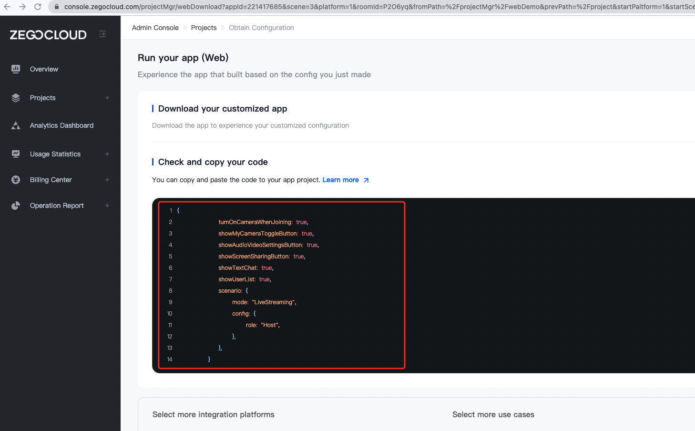
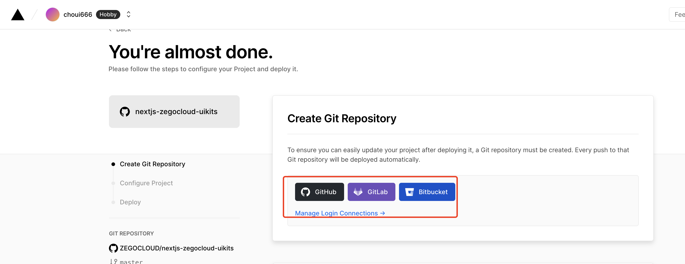
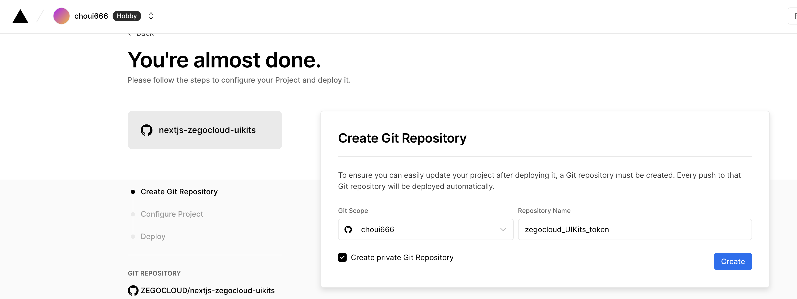
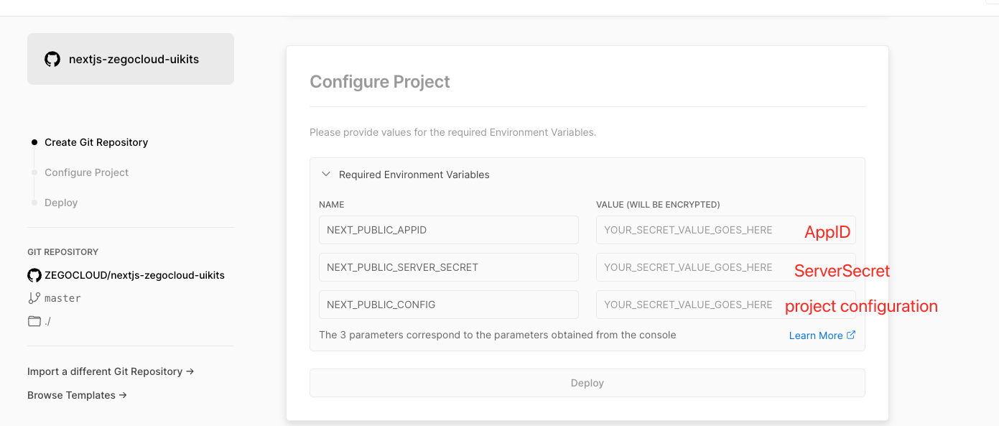
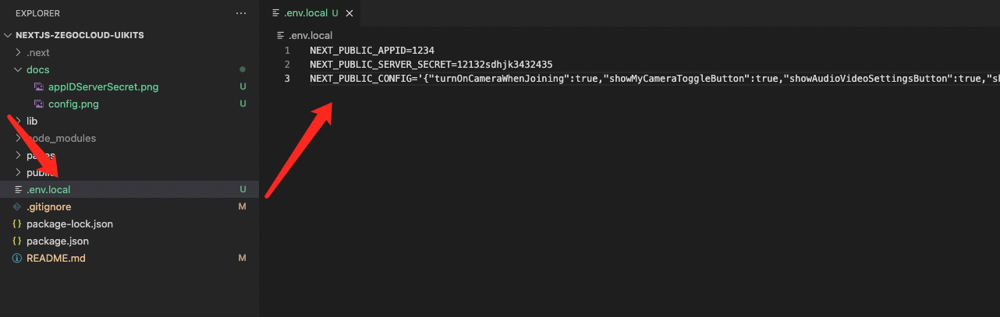

# Project Introduction

This project is the integration sample code of UIKits Web SDK from ZEGOCLOUD, coding by next.js framework

Get the project configuration file from the [ZEGOCLOUD CONSOLE](http://console.zegocloud.com/account/login), click the deploy button below, fill in the corresponding configuration, you can quickly deploy your video session application

# Preconditions

Create your UIKits web project at [ZEGOCLOUD CONSOLE](http://console.zegocloud.com/account/login), you will get AppID, ServerSecret and project configuration

### AppID, ServerSecret:



### Project configuration



# One-click deployment

### step 1

[click  ](https://vercel.com/new/clone?repository-url=https%3A%2F%2Fgithub.com%2FZEGOCLOUD%2Fnextjs-zegocloud-uikits&env=NEXT_PUBLIC_APPID,NEXT_PUBLIC_SERVER_SECRET,NEXT_PUBLIC_CONFIG&envDescription=The%203%20parameters%20correspond%20to%20the%20parameters%20obtained%20from%20the%20console&envLink=https%3A%2F%2Fgithub.com%2FZEGOCLOUD%2Fnextjs-zegocloud-uikits%23readme&project-name=nextjs-zegocloud-uikits&demo-title=nextjs-zegocloud-uikits&demo-description=nextjs-zegocloud-uikits)

### step 2

Choose your preferred code repository (recommended to use GitHub), and create a project




### step 3

Fill in the corresponding parameters


# run the project locally

- Open the `.env.local` file, and fill in the obtained relevant configuration, as shown in the following figure:



- run on current project
  ````
   npm run install
  ````
- then run
  ````
   npm run dev
  ````
